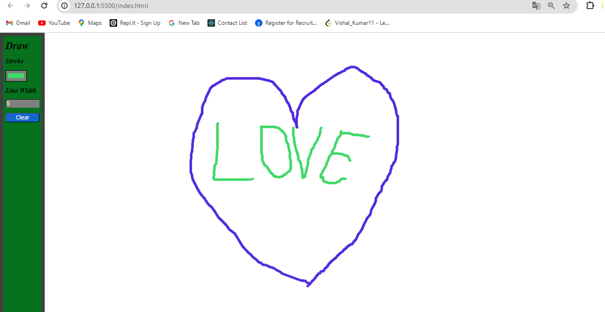

# Simple Drawing Game

<p align="justify">This is a simple web-based drawing application that allows users to draw on a canvas. Users can change the stroke color, adjust the line width, and clear the canvas.</p>

## Features

- Draw on a canvas using the mouse.
- Change the stroke color.
- Adjust the line width.
- Clear the canvas.

## Getting Started

### Prerequisites

To run this project, you need a web browser that supports HTML5, CSS, and JavaScript.

### Installation

1. Clone this repository to your local machine.
    ```bash
    git clone https://github.com/your-username/simple-drawing-game.git
    ```
2. Navigate to the project directory.
    ```bash
    cd simple-drawing-game
    ```
3. Open the `index.html` file in your web browser.

### Usage

1. Open the `index.html` file in your web browser.
2. Use the toolbar at the top of the page to:
    - Change the stroke color using the color picker.
    - Adjust the line width using the number input.
    - Clear the canvas by clicking the "Clear" button.
3. Draw on the canvas by clicking and dragging the mouse.

## Project Structure

- #### **simple-drawing-game/**
- ├── index.html # The main HTML file
- ├── style.css # The CSS file for styling
- └── script.js # The JavaScript file for functionality


#### index.html

This file contains the structure of the webpage, including the toolbar and canvas elements.

#### style.css

This file contains the styles for the webpage. It ensures the canvas and toolbar are displayed correctly.

#### script.js

This file contains the JavaScript code that makes the drawing application functional. It includes event listeners for mouse actions and toolbar interactions.

### Contributing

Contributions are welcome! If you have any suggestions or improvements, please create an issue or submit a pull request.

## License

This project is licensed under the MIT License. See the [LICENSE](LICENSE) file for details.

### output Screen

- #### Outcome Designs
